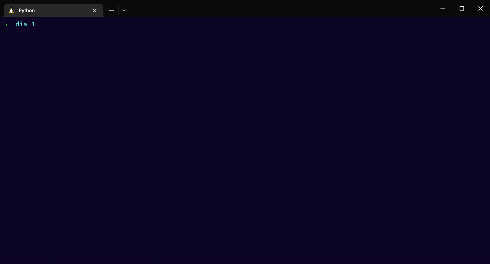
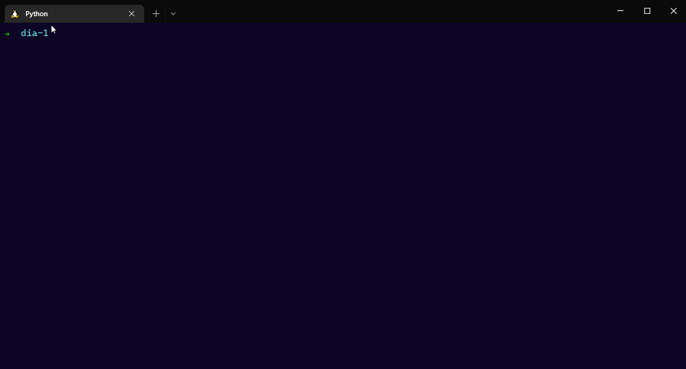
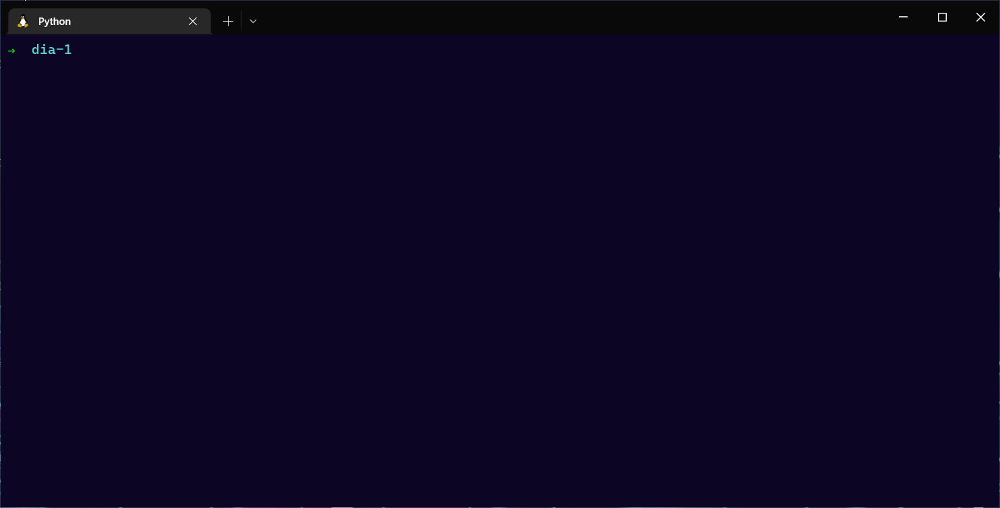
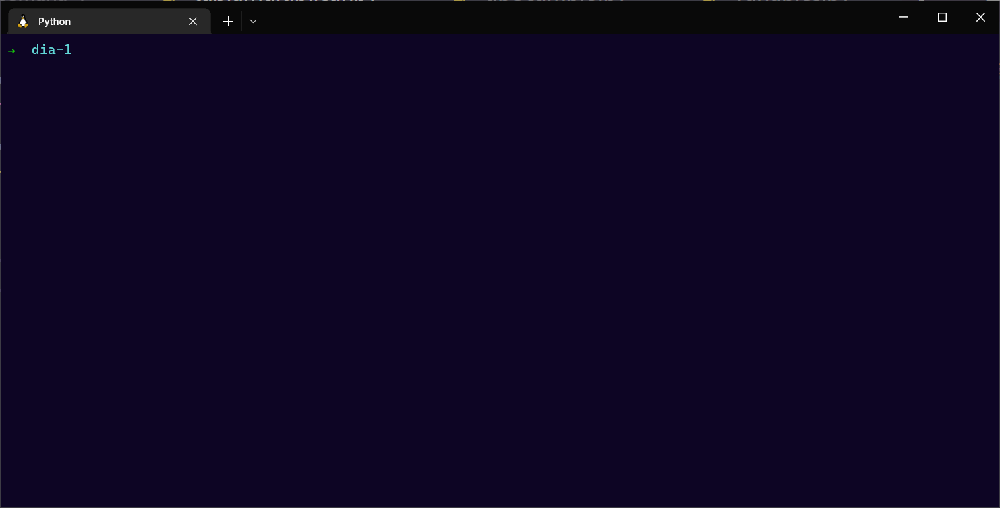

<h1 align="center">Día 1 👾👨‍💻</h1>

###  Tabla de contenido 🧭
  - [Introducción 📜][1]
  - [Tecnologías 👨‍💻][2]
  - [Características 🐍][3]
    * [Variables 📦][4]
    * [Condicionales ⁉][5]
    * [Bucles ➰💫][6]
  - [Ejercicios 👾][7]
    * [Ejercicio 1 🌌][8]
    * [Ejercicio 2 🌌][9]
    * [Ejercicio 3 🌌][10]
    * [Ejercicio 4 🌌][11]
  - [Contáctame ✉][12]


### 📜 Introducción 📜
  `Aprenderemos variables 📦, condicionales ⁉ y bucles ➰💫.`


### 🐍 Carácterísticas 🐍
  - #### Variables 📦:
    - Identación importante ☄
    - Tipado dinámico 💱 
      ```py
        numero1 = 1 # ... ✅
        # Asume que es un número
      ```
  - #### Condicionales ⁉:
    * Palabras reservadas: `if, elif, else`
    * Ejemplo: 
      ```py
      valor = 1
      if(valor > 1):
        print("El valor vale más que 1")
      if(valor == 0):
        print("El valor es nulo")
      else:
        print("Valor sin validación")
      # Output: Valor sin validación
      ```
  - #### Bucles ➰💫:
    - Palabras reservadas: `for, while`
    - Ejemplo:
       ```py
      value = 1
      while(value <= 5):
        print(value)
        value += 1
      # Output:
        # 1
        # 2
        # 3
        # 4
        # 5

      ```
    
### 👨‍💻 Tecnologías 👨‍💻

  <table>
    <thead>
      <th>
        <h3 align="center">
          Python
        </h3>
      </th>
    </thead>
    <tbody>
      <tr>
        <td align="center">
          
        </td>
      </tr>
    </tbody>
  </table>

### 👾 Ejercicios 👾
  * #### 🌌 Ejercicio 1 🌌
    - Creando una calculadora de suma. ➕
    
  * #### 🌌 Ejercicio 2 🌌
    - Convierte de soles a dólares 💵💸
    
  * #### 🌌 Ejercicio 3 🌌
    - Mejora de la cálculadora, implementando resta con condicionales ➕➖
    
  * #### 🌌 Ejercicio 4 🌌
    - Generando una tabla de multiplicar del 1 al 12 con for 📈
    

### ✉ Contáctame ✉

  * 🐙 Github: https://github.com/alejooroncoy 🐙
  * 📨 Correo: alejooroncoy2705@gmail.com 📨
  * 📸 Istagram: https://www.instagram.com/adoa_dev 📸


[1]: #-Introducción-
[2]: #-tecnologías-
[3]: #-carácterísticas-
[4]: #variables-
[5]: #condicionales-
[6]: #bucles-
[7]: #-ejercicios-
[8]: #-ejercicio-1-
[9]: #-ejercicio-2-
[10]: #-ejercicio-3-
[11]: #-ejercicio-4-
[12]: #-contáctame-